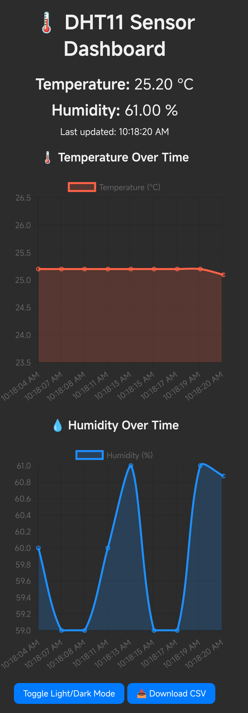
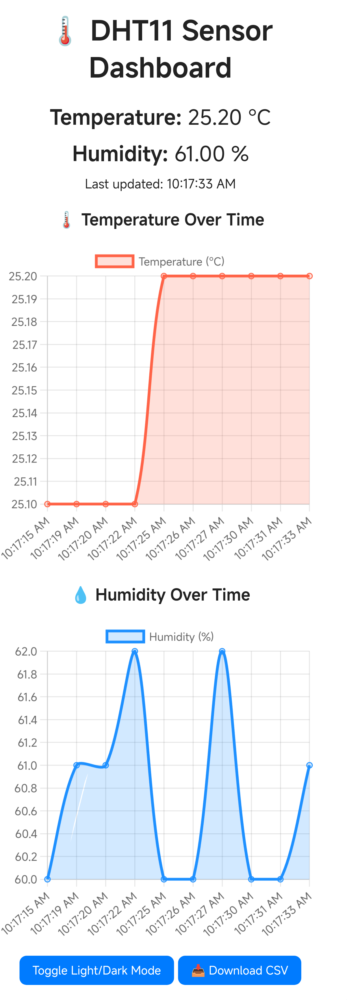

# ESP32 DHT11 Sensor Web Dashboard

A lightweight web‐based dashboard that reads temperature and humidity values from a DHT11 sensor connected to an ESP32, and serves them over Wi-Fi. The dashboard features real-time charts, light/dark mode, and CSV export.

---

## Features

- 📶 Real-time temperature (°C) & humidity (%) readings
- 🌗 Light/Dark mode toggle
- 📊 Dynamic line charts using Chart.js
- 📥 CSV download of historical data
- 📱 Simple single-page web UI, friendly for mobile and desktop

---

## Hardware Requirements

- **ESP32** Dev Module
- **DHT11** Temperature & Humidity Sensor
- **Jumper wires**
- **Breadboard** (optional)

---

## Wiring

| DHT11 Pin | ESP32 Pin |
|----------|-----------|
| VCC(Red)      | 3V3      |
| DATA(Yellow)     | GPIO 4    |
| GND(Black)      | GND       |

---

## Software Requirements

- [Arduino IDE](https://www.arduino.cc/en/software) (or PlatformIO)  
- **ESP32 board support** installed in Arduino IDE  
- **DHT sensor library** by Adafruit (or equivalent)  
- **WiFi** and **WebServer** libraries (bundled with ESP32 Arduino core)

---

## Setup Instructions

1. **Install Required Libraries:**
   - `DHT sensor library` by Adafruit
   - `Adafruit Unified Sensor` (may be required by some DHT libraries)
   - `WiFi` and `WebServer` libraries (included with ESP32 board package)

2. **Configure WiFi:**
   Replace these lines with your WiFi credentials in the code:
   ```cpp
   const char* ssid = "your-ssid";
   const char* password = "your-password";
   ```

3. **Upload Code to ESP32:**
   - Select your **ESP32 board** and the correct **COM port** from **Tools > Board** and **Tools > Port**.
   - Upload the code to your ESP32.

4. **Access Web Dashboard:**
   After uploading, open Serial Monitor at 115200 baud to get the ESP32’s IP address.

---

## Usage

1. Once the ESP32 connects to Wi-Fi, note the IP address printed in the Serial Monitor (e.g., `192.168.1.42`).

2. Open a web browser (desktop or mobile) and navigate to `http://<ESP32_IP>/`.

3. The dashboard page will load, showing live temperature and humidity readings and charts.

4. Use the “Toggle Light/Dark Mode” button to switch themes.

5. Click “📥 Download CSV” to save the current session’s data as a CSV file.

---

## Web Dashboard Overview

- **Temperature & Humidity** values update every 2 seconds.
- **Charts** display last 10 readings.
- **"Download CSV"** saves a `.csv` file of all logged data.
- **"Toggle Light/Dark Mode"** changes the theme.

---

## Code Overview

- `setup()`
   - Initializes Serial at 115200 baud
   - Starts DHT sensor
   - Connects to Wi-Fi (blocking until successful)
   - Sets up HTTP routes (/ and /data)
   - Launches WebServer on port 80

- `loop()`
   - Calls server.handleClient() to process incoming HTTP requests

- `handleRoot()`
   - Sends the full HTML/CSS/JS dashboard as a raw literal string

- `handleData()`
   - Reads temperature and humidity from DHT11
   - Formats them into JSON:
      ```json
      {
         "temperature": 23.45,
         "humidity": 56.78
      }
      ```
   - Sends JSON response with `application/json` header

---

## Endpoint Reference

| Path    | Method | Description                                |
| ------- | ------ | ------------------------------------------ |
| `/`     | GET    | Serves the HTML/CSS/JS dashboard           |
| `/data` | GET    | Returns the latest sensor readings in JSON |

---

## Customization

- **Polling Interval:** Change `setInterval(updateData, 2000);` to adjust fetch frequency.
- **Chart Length:** Modify the `if (labels.length >= 10)` threshold to keep more or fewer points.
- **Styling:** Tweak CSS variables in the `<style>` block (`--bg`, `--text`, `--card`) or add your own.

---

## Troubleshooting
- **Stuck on “Connecting to WiFi…”**
   - Verify SSID/password are correct.
   - Ensure your router’s 2.4 GHz band is enabled (ESP32 may not see 5 GHz only networks).

- **Sensor Read Errors (“⚠️ Sensor read error!”)**
   - Check wiring and resistor.
   - Ensure DHT library matches your sensor type (`DHT11`).

- **Page Not Loading**
   - Confirm the IP printed on Serial Monitor is reachable.
   - Ensure firewall/router is not blocking port 80.

---

## Example Screenshots

<p align="center">
  
  
</p>

> You can customize the HTML/CSS inside the `handleRoot()` function to change appearance or add new features.

## License

This project is licensed under the [MIT License](LICENSE).

---

**Enjoy monitoring your environment with your ESP32 & DHT11!***
